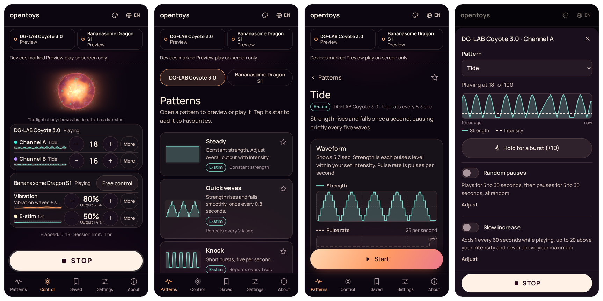
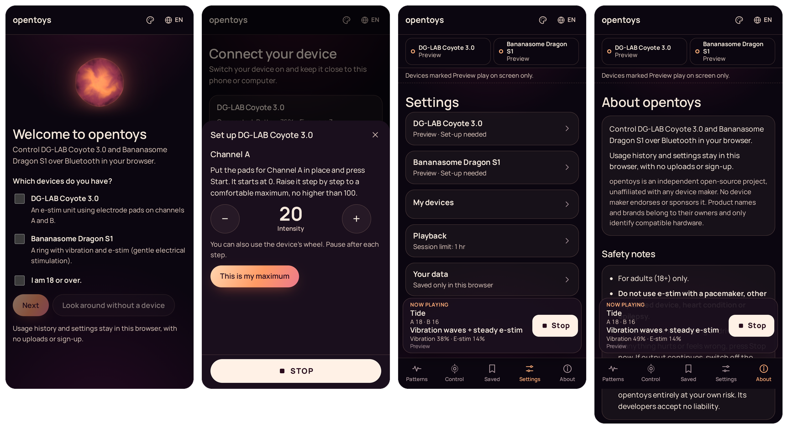

# opentoys

**Control your intimate devices from the browser: DG-LAB Coyote 3.0 and Bananasome Dragon S1. See every pattern's waveform before you play it.**

[English](README.md) · [繁體中文](README.zh-Hant.md) · [简体中文](README.zh-Hans.md)

## Try it

**[opentoys.securely.work](https://opentoys.securely.work)** in Chrome or Edge, on Android or on a computer. There is nothing to install.

No device at hand? Confirm that you are 18 or over, then tap **Look around without a device** on the first screen. Patterns play on screen, so you can see how it works before you connect anything.



## What you get

- **Two devices, one screen.** Use either device alone or both together. **Stop** ends playback on both. If a device keeps going, switch it off at the device.
- **Patterns you can see first.** Every pattern shows its waveform before you start it. Adjustable patterns redraw as you change them.
- **Your own limits.** You set each output's maximum by feeling it, and the app keeps what it sends within that maximum.
- **Stored in your browser.** Your usage history and settings stay in your browser, where you can export or delete them. There is no sign-up and no tracking.
- **Works offline.** After the first visit the app is cached, so it opens without a connection. You can also add it to your home screen.
- **Three languages:** English, 繁體中文 and 简体中文.
- **Four colour modes,** dark and light.

## Supported devices

| Device | What it is | Maker's page |
|---|---|---|
| **DG-LAB Coyote 3.0** | An e-stim unit with two channels, used with electrode pads | [dungeon-lab.com](https://www.dungeon-lab.com/products/COYOTE-030) |
| **Bananasome Dragon S1** | A ring with vibration and e-stim | [bananasome.com](https://bananasome.com/pages/dragon-s1) |

Both were tested on real hardware with Chrome on Android. Details are in [docs/DEVICES.md](docs/DEVICES.md).

DG-LAB publishes the Bluetooth protocol of the DG-LAB Coyote 3.0 in its own [repository on GitHub](https://github.com/dungeonlab-open/dglab-bluetooth-protocol), and opentoys implements it.

> opentoys is an independent, non-commercial project, unaffiliated with any device maker. No device maker endorses or sponsors it. Product names and brands belong to their owners and only identify compatible hardware.

## A closer look



The first time a device connects, opentoys opens its safety notes and its set-up. Before any e-stim plays, you feel the intensity and confirm your maximum. Vibration can use the default range.


## Safety

opentoys is for adults aged 18 and over. Do not use e-stim if you have a pacemaker or another implanted device, a heart condition or epilepsy. Read the safety notes in the app and the instructions that came with your device before use.

The app limits output in several ways, described in [docs/SAFETY.md](docs/SAFETY.md). Those limits are defaults in code that runs in the browser, and anyone can change them by changing the code. They reduce risk and do not guarantee safety. You are responsible for your safety and use opentoys entirely at your own risk. Its developers accept no liability.

## Which browsers

Chrome or Edge on Android, Windows, macOS or ChromeOS. These browsers have Web Bluetooth, which lets a web page talk to a nearby device once you pick it from a list. opentoys has been tested on Android. iPhone and iPad are not supported, because their browsers do not have Web Bluetooth.

## Run it yourself

You need Node.js 20.19 or later in the 20 series, or 22.12 or newer.

```sh
git clone https://github.com/jason-chao/opentoys.git
cd opentoys
npm install
npm run dev          # http://localhost:5173
```

The site is static. `npm run build` writes it to `apps/web/build/`, and any HTTPS host can serve it. [deploy/docker](deploy/docker) has a ready-made container with the security headers.

## Contributing

Bug reports, device reports and translations are welcome.

- [docs/DEVELOPMENT.md](docs/DEVELOPMENT.md): how the code is organised, the checks, and how to add a language or a device.
- [docs/SAFETY.md](docs/SAFETY.md): what the app does to keep output within limits.
- [docs/DEVICES.md](docs/DEVICES.md): what is known about each device and what was tested.
- [i18n/glossary.md](i18n/glossary.md): the fixed terms in each language.

## Licence

Licensed under [PolyForm Noncommercial 1.0.0](LICENSE). Non-commercial use is permitted on the terms of that licence. [NOTICE](NOTICE) explains DG-LAB's condition on commercial use of its protocol content, and that anyone who reuses this code is responsible for their use of it.
