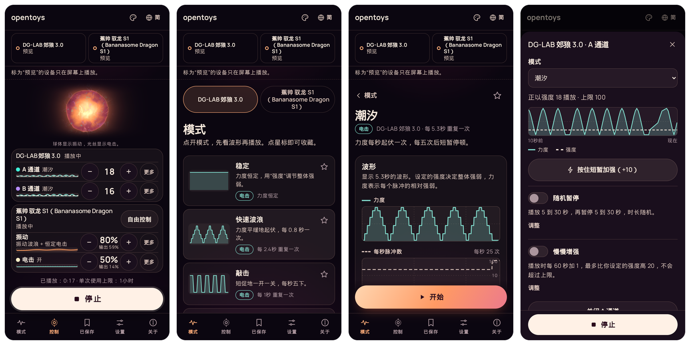
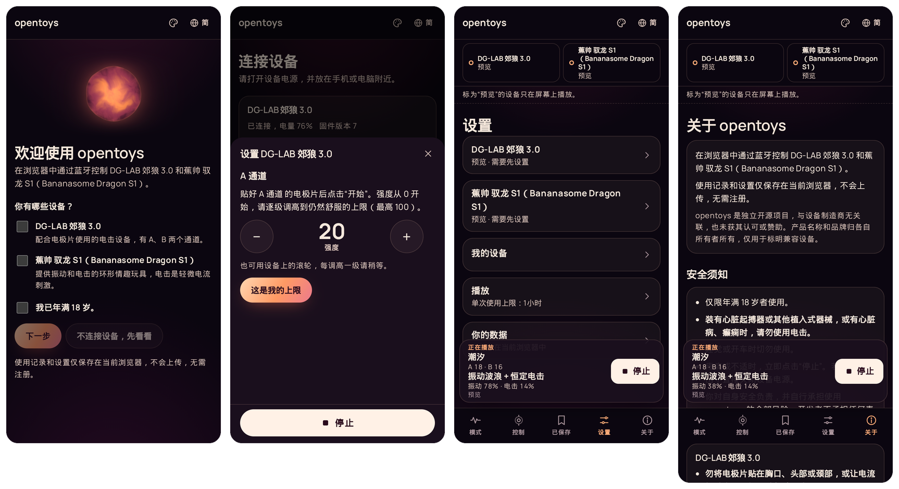

# opentoys

**在浏览器中通过蓝牙控制情趣玩具。专为 [DG-LAB 郊狼 3.0](https://www.dungeon-lab.com/products/COYOTE-030)（DG-LAB Coyote 3.0）打造：每个模式都能先看波形再播放，上限自己定，数据只保存在你的浏览器里。**

也支持 [蕉帅 驭龙 S1](https://bananasome.com/pages/dragon-s1)（Bananasome Dragon S1）环形玩具，可以单独用，也可以和 DG-LAB 郊狼 3.0 一起用。

[English](README.md) · [繁體中文](README.zh-Hant.md) · [简体中文](README.zh-Hans.md)

## 马上试试

用安卓手机或电脑上的 Chrome 或 Edge，打开 **[opentoys.securely.work](https://opentoys.securely.work)**，无需安装。

没有设备也能先体验。在第一个页面确认已年满 18 岁，再点“不连接设备，先看看”，模式就会在屏幕上播放，不用连接设备也能先了解怎么用。



## 功能

- **两个通道，同屏控制。** A、B 通道各有自己的模式、强度和实时曲线，点击“停止”可停止所有设备的播放。如果设备仍有输出，请直接关闭设备电源。
- **先看波形，再开始。** 每个模式开始前都能看到波形。可调节的模式会随你的设置实时重绘。
- **上限自己定。** 根据实际感受设置各项输出的上限，opentoys 发送的强度不会超过这些上限。
- **数据保存在浏览器里。** 使用记录和设置只保存在你的浏览器中，随时可以导出或删除。无需注册，也不跟踪你的使用情况。
- **支持离线使用。** 第一次打开后，浏览器会缓存网站内容，之后离线也能使用。也可以把它添加到主屏幕。
- **还能再加一台设备。** 加上蕉帅 驭龙 S1（Bananasome Dragon S1），和 DG-LAB 郊狼 3.0 一起用。
- **三种语言：** English、繁體中文和简体中文。
- **四种配色**，深色浅色都有。

## 支持的设备

| 设备 | 简介 | 厂商页面 |
|---|---|---|
| **DG-LAB 郊狼 3.0**（DG-LAB Coyote 3.0） | 双通道电击设备，配合电极片使用 | [dungeon-lab.com](https://www.dungeon-lab.com/products/COYOTE-030) |
| **蕉帅 驭龙 S1**（Bananasome Dragon S1） | 带振动和电击功能的环形情趣玩具 | [bananasome.com](https://bananasome.com/pages/dragon-s1) |

DG-LAB 在 GitHub 的[公开仓库](https://github.com/dungeonlab-open/dglab-bluetooth-protocol)里发布了 DG-LAB 郊狼 3.0 的蓝牙协议，opentoys 按这份协议实现。

两台设备都已在安卓版 Chrome 上做过真机测试，详见 [docs/DEVICES.md](docs/DEVICES.md)。

> opentoys 是独立的非商业项目，与设备制造商无关联，也未获其认可或赞助。产品名称和品牌归各自所有者所有，仅用于标明兼容设备。

## 界面预览



设备第一次连接时，opentoys 会打开它的安全须知并引导设置。播放电击之前，需要亲身感受强度并确认上限。振动可以使用默认范围。


## 安全

opentoys 仅供年满 18 岁的人使用。装有心脏起搏器或其他植入式器械，或患有心脏病、癫痫的人，请勿使用电击。使用前，请阅读应用内的安全须知和设备随附的说明。

opentoys 会从多个方面限制输出，详见 [docs/SAFETY.md](docs/SAFETY.md)。这些默认限制由浏览器中的代码控制，修改代码即可改变。它们只能降低风险，不能保证安全。你对自身安全负责，并自行承担使用 opentoys 的全部风险。开发者不承担任何责任。

## 支持的浏览器

安卓、Windows、macOS 或 ChromeOS 上的 Chrome 或 Edge。这两款浏览器支持 Web Bluetooth，你从列表里选好设备后，网页就能和附近的设备通信。opentoys 已在安卓上测试。iPhone 和 iPad 的浏览器没有 Web Bluetooth，因此不支持。

## 自行部署

需要 Node.js 20.x（至少 20.19），或 22.12 及更高版本。

```sh
git clone https://github.com/jason-chao/opentoys.git
cd opentoys
npm install
npm run dev          # http://localhost:5173
```

这是一个静态网站。`npm run build` 会把网站输出到 `apps/web/build/`，任何支持 HTTPS 的主机都能托管。[deploy/docker](deploy/docker) 提供现成的容器配置，已包含安全响应头。

## 参与贡献

欢迎反馈问题、分享设备使用情况，或帮忙翻译。以下文档为英文：

- [docs/DEVELOPMENT.md](docs/DEVELOPMENT.md)：代码结构、各项检查，以及如何添加新语言或新设备。
- [docs/SAFETY.md](docs/SAFETY.md)：opentoys 如何把输出控制在上限之内。
- [docs/DEVICES.md](docs/DEVICES.md)：各设备的已知信息和测试结果。
- [i18n/glossary.md](i18n/glossary.md)：各语言的固定用词。

## 许可证

opentoys 采用 [PolyForm Noncommercial 1.0.0](LICENSE) 许可证，允许非商业用途，使用时须遵守许可证条款。[NOTICE](NOTICE)（英文）说明了 DG-LAB 对其协议内容的商业使用要求，以及复用本项目代码需自行承担的责任。
