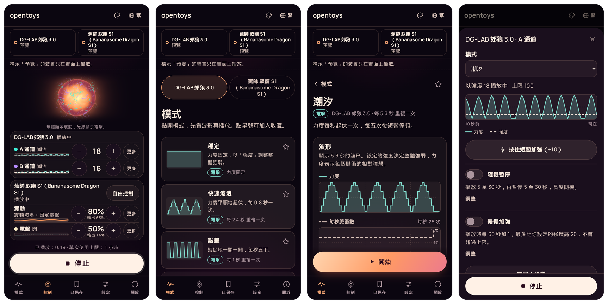
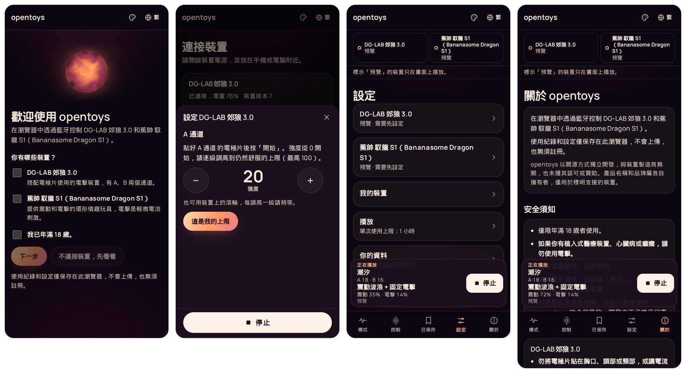
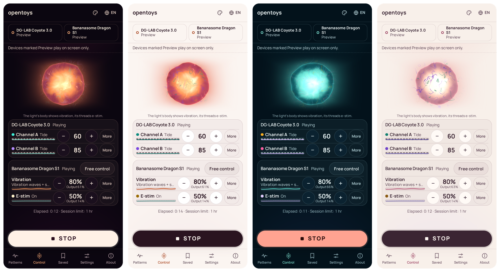

# opentoys

**在瀏覽器中透過藍牙控制情趣玩具。專為 [DG-LAB 郊狼 3.0](https://www.dungeon-lab.com/products/COYOTE-030)（DG-LAB Coyote 3.0）設計：每個模式都能先看波形再播放，上限由你決定，資料只保存在你的瀏覽器中。**

也支援 [蕉帥 馭龍 S1](https://bananasome.com/pages/dragon-s1)（Bananasome Dragon S1）環形玩具，可以單獨使用，也可以和 DG-LAB 郊狼 3.0 一起用。

[English](README.md) · [繁體中文](README.zh-Hant.md) · [简体中文](README.zh-Hans.md)

## 立即試用

用 Android 手機或電腦上的 Chrome 或 Edge，打開 **[opentoys.securely.work](https://opentoys.securely.work)**，不必安裝。

沒有裝置也能先試用。在第一個畫面確認已年滿 18 歲，再選「不連接裝置，先看看」，模式就會在畫面上播放，連接裝置之前就能先了解用法。



## 功能

- **兩個通道，一個畫面。** A、B 通道各有自己的模式、強度和即時曲線，按下「停止」可停止所有裝置的播放。若裝置仍有輸出，請直接關閉裝置電源。
- **先看波形，再開始。** 每個模式開始前都能看到波形。可調整的模式會隨你的設定即時重畫。
- **上限由你決定。** 按自己的感受設定各項輸出的上限，opentoys 傳送的強度不會超過這些上限。
- **資料保存在瀏覽器。** 使用紀錄和設定只保存在你的瀏覽器中，隨時可以匯出或刪除。不必註冊，也不追蹤你的使用情況。
- **離線可用。** 第一次開啟後，瀏覽器會保存網站內容，之後離線也能使用。也可以把它加到主畫面。
- **可以再加一部裝置。** 加入蕉帥 馭龍 S1（Bananasome Dragon S1），和 DG-LAB 郊狼 3.0 一起使用。
- **三種語言：** English、繁體中文和简体中文。
- **四種配色**，有深色也有淺色。

## 支援的裝置

| 裝置 | 簡介 | 製造商頁面 |
|---|---|---|
| **DG-LAB 郊狼 3.0**（DG-LAB Coyote 3.0） | 雙通道電擊裝置，配合電極片使用 | [dungeon-lab.com](https://www.dungeon-lab.com/products/COYOTE-030) |
| **蕉帥 馭龍 S1**（Bananasome Dragon S1） | 具備震動和電擊功能的環形情趣玩具 | [bananasome.com](https://bananasome.com/pages/dragon-s1) |

DG-LAB 在 GitHub 上的[公開倉庫](https://github.com/dungeonlab-open/dglab-bluetooth-protocol)發布了 DG-LAB 郊狼 3.0 的藍牙協議，opentoys 依照這份協議實作。

兩部裝置都已在 Android 版 Chrome 上實機測試，詳情見 [docs/DEVICES.md](docs/DEVICES.md)。

> opentoys 獨立開發，不作商業用途，與裝置製造商無關，也未獲其認可或贊助。產品名稱和品牌屬各自擁有者，僅用於標明支援的裝置。

## 畫面預覽



裝置第一次連接時，opentoys 會開啟它的安全須知和設定步驟。播放電擊之前，須先親身感受強度並確認上限。震動可以使用預設範圍。



## 安全

opentoys 僅供年滿 18 歲的人使用。如有植入式裝置（包括調節心跳的裝置）、心臟病或癲癇，請勿使用電擊。使用前，請閱讀程式內的安全須知和裝置隨附的說明。

opentoys 會從多方面限制輸出，詳見 [docs/SAFETY.md](docs/SAFETY.md)。這些限制是瀏覽器內程式的預設值，修改程式便可改變限制。這些措施只能降低風險，不能保證安全。你須對自身安全負責，並自行承擔使用 opentoys 的全部風險。開發者不承擔任何責任。

## 支援的瀏覽器

Android、Windows、macOS 或 ChromeOS 上的 Chrome 或 Edge。這兩款瀏覽器支援 Web Bluetooth，你從清單中選好裝置後，網頁就能與附近的裝置通訊。opentoys 已在 Android 上測試。iPhone 和 iPad 的瀏覽器沒有 Web Bluetooth，因此不支援。

## 自行架設

需要 Node.js 20.x（至少 20.19），或 22.12 及以上版本。

```sh
git clone https://github.com/jason-chao/opentoys.git
cd opentoys
npm install
npm run dev          # http://localhost:5173
```

這是靜態網站。`npm run build` 會把網站輸出到 `apps/web/build/`，任何支援 HTTPS 的主機都能提供服務。[deploy/docker](deploy/docker) 提供現成的容器設定，已包含安全標頭。

## 參與貢獻

歡迎回報問題、分享裝置使用情況，或協助翻譯。以下文件以英文撰寫：

- [docs/DEVELOPMENT.md](docs/DEVELOPMENT.md)：程式結構、各項檢查，以及如何加入新語言或新裝置。
- [docs/SAFETY.md](docs/SAFETY.md)：opentoys 如何把輸出控制在上限之內。
- [docs/DEVICES.md](docs/DEVICES.md)：各裝置的已知資料和測試結果。
- [i18n/glossary.md](i18n/glossary.md)：各語言的固定用詞。

## 授權

opentoys 採用 [PolyForm Noncommercial 1.0.0](LICENSE) 授權，可用於非商業用途，但須遵守授權條款。[NOTICE](NOTICE)（英文）說明 DG-LAB 對其協議內容商業用途的要求，以及他人重用 opentoys 時須自行承擔的責任。
